# Assessment 1: Replication project

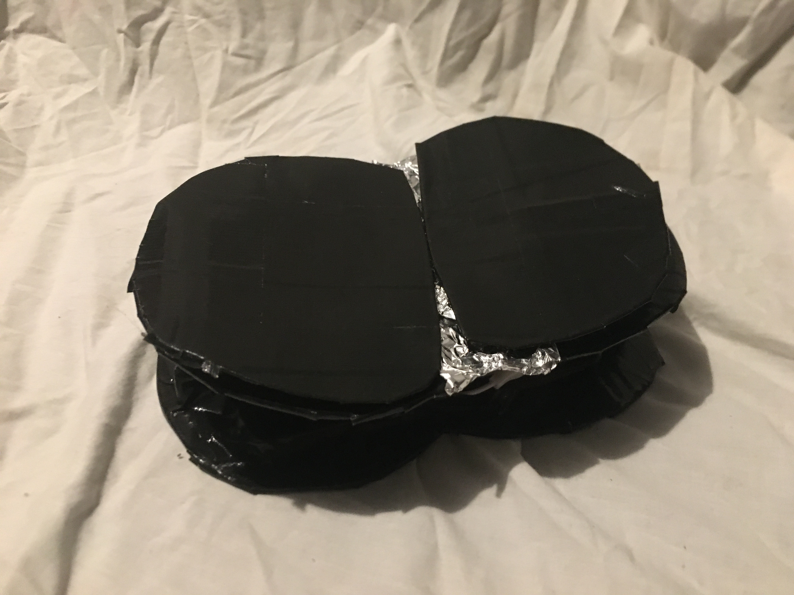

## Project Replicated ##
The project that was chosen to be replicated was the Guitar found at  https://makecode.microbit.org/projects/guitar. This was chosen as I thought it would be interesting to create an electronic instrument. 
## Related projects ##

### Related project 1 ###
Thermal Detonator Kit

https://thesaberarmory.com/product/kr-x-or-td-diy-prop-fx-kit/
And as seen built by Adam Savage in this video: https://www.youtube.com/watch?v=ZjpPgv9XtJA

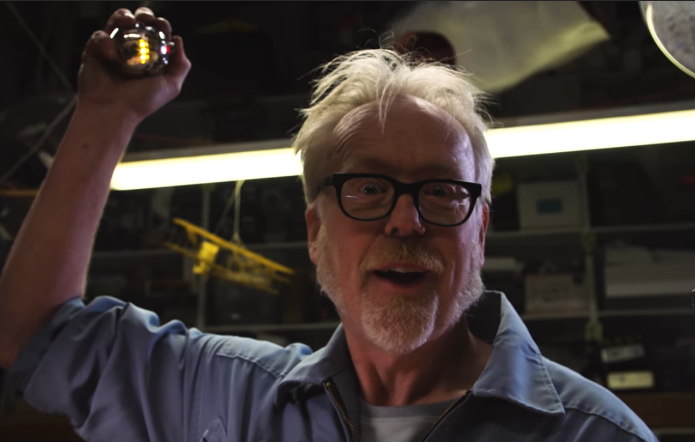

(Timestamp 15:56)

This project is related to mine because in essence the kit involves creating a replica from Star Wars that makes a sound and lights up when the switch is activated. On the pure electric and basic principle level this is what I hope for my finale project to do.

### Related project 2 ###

Kill Mii: Portable Wii in an Altoids Tin

https://www.youtube.com/watch?v=2VOLUOIwbP4
Worklog: https://bitbuilt.net/forums/index.php?threads/kill-mii-altoids-tin-portable.1310/

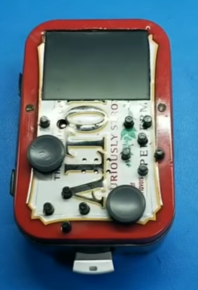

(Timestamp 0:01) 

This project relates to mine as the DIY approach and the concept of making what at the time was such a complex technology into something as small as an Altoids tin in fascinating. The DIY approach to design and manufacturing is compelling and how I plan to create my project. Do what you can with what you have and because for some reason you just have too.  

### Related project 3 ###

Hacking my arm prosthesis to output CV so that it plugs into my synth: Thought-controlled music!
https://www.youtube.com/watch?v=qSKBtEBRWi4&t=72s

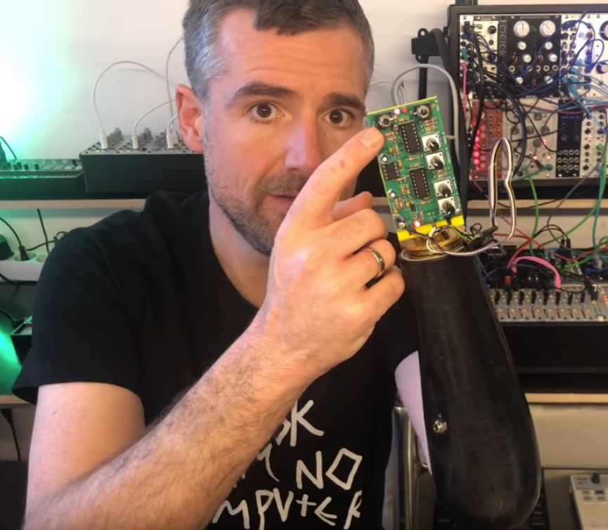

(Timestamp 5:41)

The idea of controlling a synthesiser with your brain blew my mind when I first saw the title. The aspects of this project that relates to mine is both the DIY aspect as well as the musical element. The musical element of being able to control a synthesiser with an arm prosthesis would be out of my reach currently but it could be an avenue of electronic music I could look further into. How the human body has been creating music since its birth and how into the modern era it is constantly evolving. 

### Related project 4 ###

Thingamagoop 2 by Bleep Labs
https://www.wired.com/2012/01/thingamagoop/
https://bleeplabs.com/product/thingamagoop-2x/

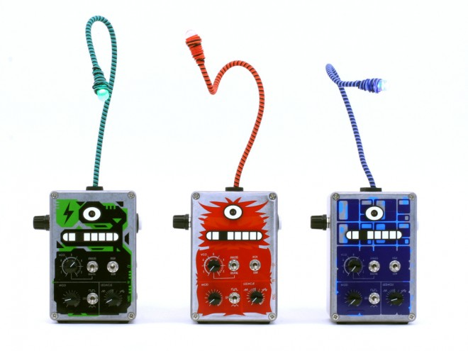

(Sourced from https://www.wired.com/2012/01/thingamagoop/)

This project is a kit to designed to create music using an audino. This project is relavant to mine as it an interaction basesd music music device. The interactions with the buttons and lights creates an interesting music experiance. Creating interesting an complex strings of music with both light, button and switch inputs. 

### Related project 5 ###
How To Make Mini Piano Music Machine From Cardboad! DIY Music Machine
https://www.youtube.com/watch?v=OZqBrKHT63o

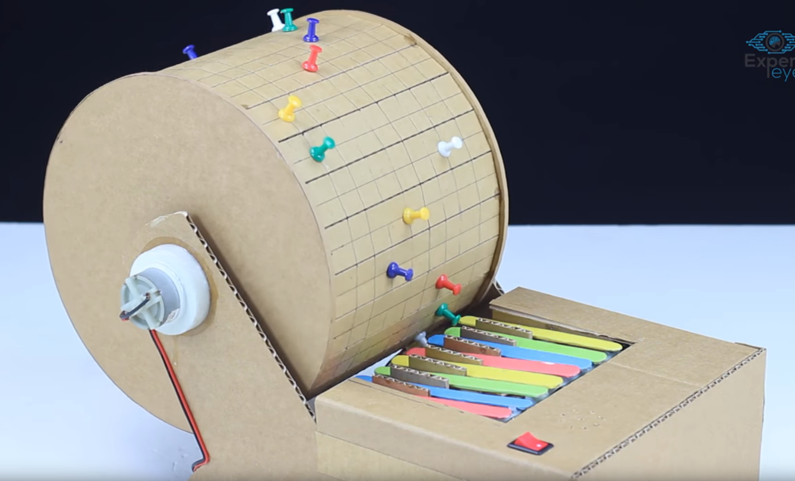

(Timestamp 0:04)

This project is extremly relevant to my project as it is intersection of creating old technolgy with new and diy music making. The replication of old music devices is a factor I have wanted to create in my own project by recreating one of mans first musical insturments in an electronic form. This project also has the DIY cardord aesthteics I wish to recreate.

## Reading reflections ##

### Reading: Don Norman, The Design of Everyday Things, Chapter 1 (The Psychopathology of Everyday Things) ###

Before reading this I understood that certain things do certain things just because that’s what they do. For example a twist door knob means you push. However I did know that this innate understanding of objects was a part of a complex system of design called signifiers. 

Don Norman’s descriptions of how design has changed and shaped the world around us. This has changed my knowledge of how as a designer you interact with the process of design. How do you design for the human element, what signifiers do you embed into design to make sure a person knows how to use something. 

I would like to know more about how you can create more effective mapping within design and graphic design. How do you implement a natural feel to objects and graphics?  

The feedback and signifiers elements relate to the project as they are ideas in my project. The instant feedback from a tap is sound. This creates the interaction within my project. 

### Reading: Chapter 1 of Dan Saffer, Microinteractions: Designing with Details, Chapter 1 ###

Before reading this chapter on microtransactions I never considered how important the small interactions with technology impact the broader things it does. 

I learnt how the interplay of well-designed micro transactions and macro design create an enjoyable experience for the end user. The fact that simpler is often better when it comes to micro transactions especially when dealing with large scale use. The flow of micro transactions is the trigger that then follows if the rules of it have been filled, the user feedback and then it loops back on itself. 

How do we incorporate feedback into micro transactions that take place away from physical and visual environments? 

Creating more of a tactical experience using micro transactions within my project could make it more user friendly.

### Reading: Scott Sullivan, Prototyping Interactive Objects ###

With a lot of design work it is shown in the abstract without any context. Designers tend to gloss over the flaws or short coming of a design however Sullivan dismissed my ideas of how designers polish the journey of their designs.

 I learnt that the more you do something and actually take leaps to do you can create something just for the fun of learning.  
The iterative proses of this project is relevant to my project. As the project does not have an end finished point it can also be added onto and improved from the first design we chose.

## Interaction flowchart ##

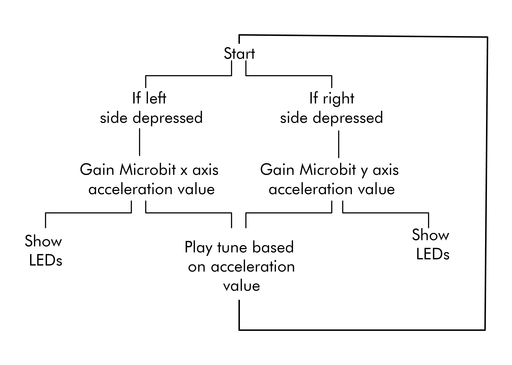

## Process documentation

### Sketch Work ###

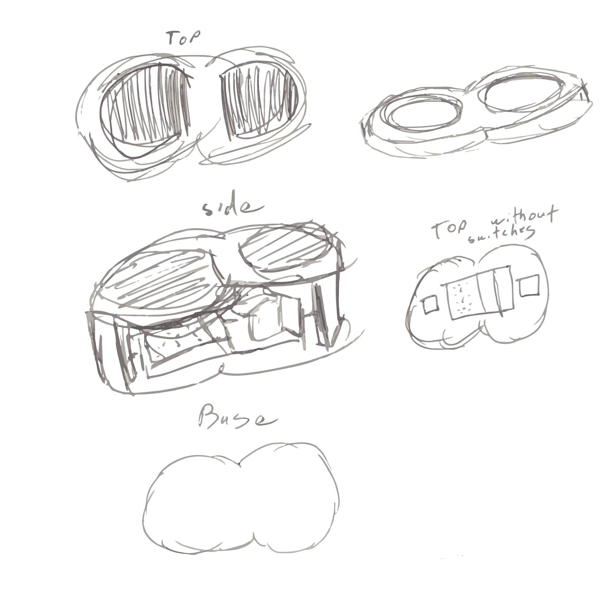

### Prototype Building ###

The initial stages of circuit board and switch development. Testing to make sure the circuit was wired correctly. Show LEDs was added to the Microbit to make sure the circuit was running even if noise wasn’t being made. The first stages of making a switch out of aluminon foil and cardboard. 

The initial base cut out of box cardboard; two of these where cut. The Microbit placed on the base to make sure there was enough room for everything. Small pieces of cardboard where cut out and glued together to create legs for over circuit board The second base plate had holes cut to create a top for the buttons to sit on.  

Unseen here two cut outs of half circles from thinner cardboard where created. These where then covered in duct tape to create black and shiny finish as well as create more stability with the cardboard. This was repeated to make a second button. A sheet of aluminium foil was hot glued to the back of one of the pedals. The bridge was coated in sheet of aluminium foil to create the second contacts on the board. However whilst doing this I hade the idea to make just one ground contact point both of the buttons as the wiring was getting to tangled and the share the same space any way. 

The Microbit and bread board was added un the bridge to make sure there where spots it could get though. The idea to have the middle section of the cut-out holes be the grounding for the circuit was applied. This grounding was connected to switches by the underneath layer having aluminium foil applied. Aluminium foil covered the bottom hinge and extended out a hole down the bottom. This was then connected though the bottom of the circuit board underneath. It was then tested to make sure it worked. At this stage it just made a high sound when the left was pressed and a low sound when the right was. 

### Coding ###

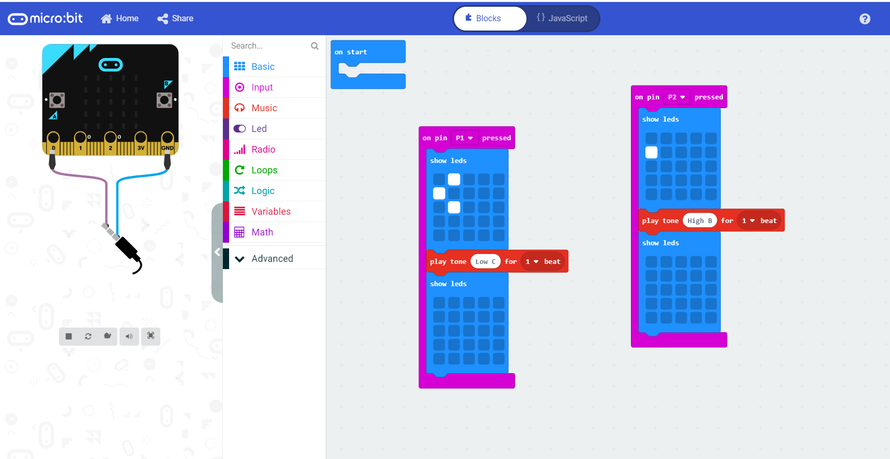
I thought this was too simple and added the acceleration value code to the note code. This addition created more of an interactive experience when the user was playing the bongos.  
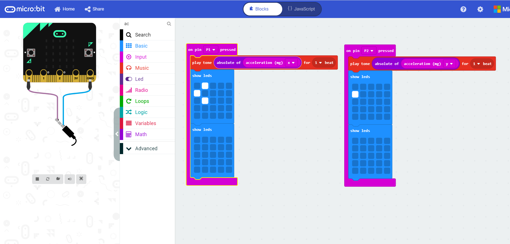

## Project outcome ##

### The Drunk Bongos ###

### Project description ###

The Drunk Bongos are a musical experiment. How can you turn one of humanity’s first instruments into something electronic and modern in a DIY environment? The target audience of The Drunk Bongos are for those bored quarantine and want to partake in an age-old tradition of making music.  

### Showcase image ###

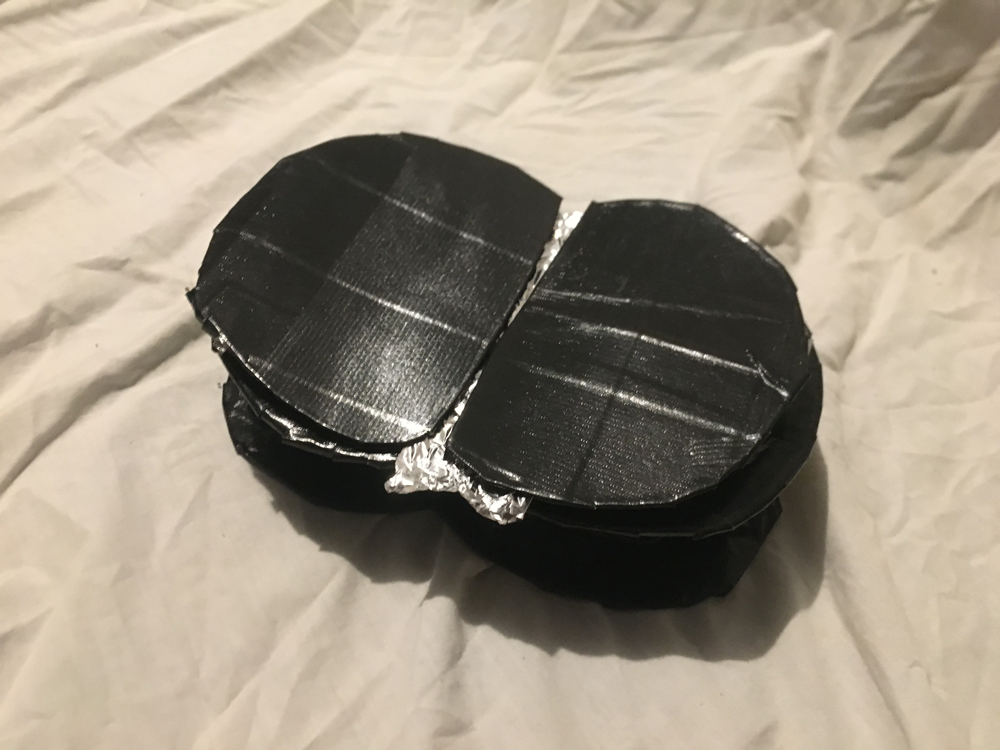

### Additional view ###

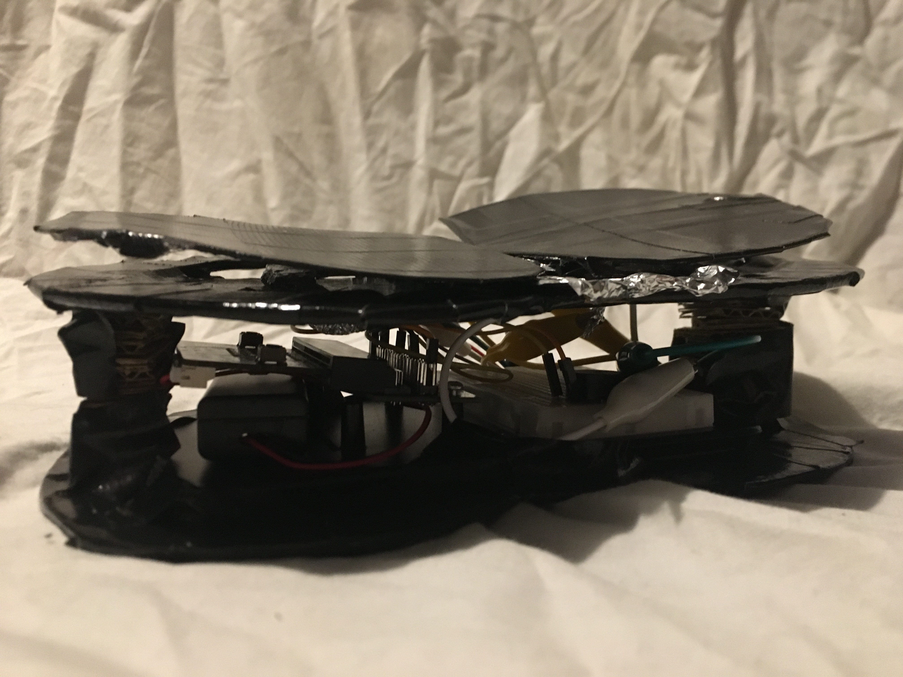

Video of my roommate playing with the bongos. (Sorry for the poor audio quality) 
https://www.youtube.com/watch?v=8aa-VMEHf9c

### Reflection ###

I felt the introduction of using the accelerometer that was built into the Microbit for pitch elevation was the most successful part of the project. It created a real sense of user interaction. The fabrication of the project could have been greatly improved. If it wasn’t in the middle of a pandemic laser cut wooden pieces could have greatly improved the quality of the end product.  

I approached this with a similar intent as project 2 and 3. The intent to see what a person can DIY because they can. I also wanted to create something fun and interactive like project 4. 

Digital imaging and prehistoric imagery: a new analysis of the Folkton Drums was read before starting this project. It was fascinating to discover how heavily decorated drums where found in modern day Britain dating back to Neolithic Era. I was fascinated by the idea of recreating something from human history and the drum became that idea.  Jones, Andrew Meirion, Andrew Cochrane, Chris Carter, Ian Dawson, Marta Díaz-Guardamino, Eleni Kotoula, and Louisa Minkin. “Digital Imaging and Prehistoric Imagery: a New Analysis of the Folkton Drums.” Antiquity 89, no. 347 (2015): 1083–95. https://doi.org/10.15184/aqy.2015.127.

This project could be extended into a whole band of electronic instruments. With different instruments interacting in different ways such as using light or moisture to detect variations.  This project could be used in physical therapy cases  to help coordination in the arms and hand. 
